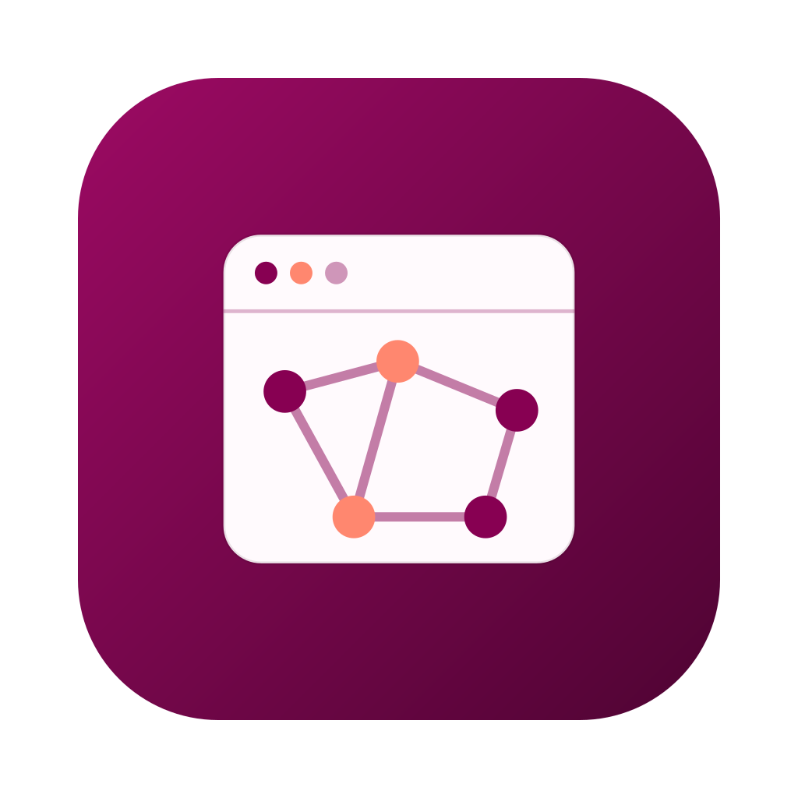

<p align="center">
  
</p>

<h1 align="center">KaroSpaceAgent</h1>

A standalone agent that builds a [KaroSpace](../KaroSpace) spatial-transcriptomics
viewer from a raw `.h5ad` / SpatialData `.zarr` file.

```bash
karospace-agent build ~/data/my_xenium.h5ad "grid by sample, colour by cell_type"
```

It can also **start from a public GEO accession** instead of a local file:
`geo_manifest` lists a series' samples, files, and inferred platform, and
`geo_build` downloads only the matrix members needed to construct the AnnData
— for a Xenium sample it range-fetches `cell_feature_matrix.h5` + `cells.parquet`
out of the multi-GB `outs.zip` rather than the whole archive — and writes a
minimal `.h5ad` (raw counts + spatial coordinates) ready for the pipeline above.
Xenium, Visium, and MERSCOPE/MERFISH (Vizgen) layouts are supported; other
platforms report what an assembler would need. Only public GEO catalogue
metadata crosses the boundary; the download and assembly run locally.

It can also **ingest a local folder of raw spatial output bundles**: `ingest_spatial`
walks a directory of bundles, auto-detecting the vendor layout per bundle — Xenium
(`cell_feature_matrix.h5` + `cells.parquet` / `cells.csv`) and MERSCOPE / MERFISH
(Vizgen's `cell_by_gene.csv` + `cell_metadata.csv`), and a folder mixing both is
fine — assembles them with the same cores the GEO builder uses (so a locally-ingested
and a GEO-built `.h5ad` are structurally identical), and concatenates them into one
file with a per-cell `sample_id`. `qc_filter` is a standalone step that drops
low-quality cells by total counts / detected genes before clustering, and R objects
can be **converted and checked** with `rds_convert` / `rds_validate` (Seurat /
SingleCellExperiment via rds2h5ad). All of these run locally; only aggregate counts
(samples, cells, genes, per-platform bundle counts, before/after) cross the boundary
— never a bundle folder name (which becomes a `sample_id` value), a path, or a
coordinate.

It exists because getting from raw data to a good viewer means choosing ~30
correct flags for a messy dataset — and *knowing which choices are right* takes
some spatial-transcriptomics expertise. The agent supplies that judgement: it
inspects the data's metadata, reasons about the right parameters (which column is
the section key, which is the main annotation, whether pseudobulk makes sense for
the experimental design, …), can propose separate panels for co-captured tissue
pieces for local review while preserving biological replicate identities, optionally
enriches the file with [KaroSpaceCompanion](../KaroSpaceCompanion), runs the
export, reads errors and iterates, validates the result, and runs a schema-only
self-review of its own
flag choices — the known traps (a placeholder section key, an un-exposed
annotation, doubly-normalized coloring, a skipped neighbor graph) — before it
reports success.

This is complementary to
[KaroSpaceBuilder](https://github.com/christoffermattssonlangseth/KaroSpaceBuilder),
the desktop GUI for the same export: the Builder puts every knob in front of you
as a clickable form, while the Agent decides the settings for you from the data
and a plain-English intent. Two ways in for two kinds of user — and a natural fit
to combine, with the Agent pre-filling a Builder-style form you can then review
and tweak before exporting.

The Python app supports the [Claude Agent SDK](https://code.claude.com/docs/en/agent-sdk)
and [Codex app-server](https://developers.openai.com/codex/app-server).
Both use local computation and the same sanitizing KaroSpace tools.

> The workflow also runs inside [Codex](#using-it-inside-codex) or
> [Claude Code](#using-it-inside-claude-code), using the local KaroSpace CLIs
> without installing the standalone agent app.

## Data safety (non-negotiable)

The standalone app keeps dataset values, local filenames, schema labels, and raw
command output out of model-bound tool replies. Both backends use the same
allowlist in `app/karospace_agent/privacy.py`:

- Paths and column/layer/embedding names become opaque aliases. The mapping stays
  in local memory; local tools resolve aliases when they run.
- Replies contain recognized types, counts, shapes, fixed role hints and status
  codes. Errors and logs stay local. Unexpected schema formats fail closed.
- Claude has no built-in tools. Codex gets no filesystem execution environment,
  and uses an isolated temporary profile without the user's instructions, skills,
  plugins, MCP configuration or history.
- Every message, including an opening build request, requires a local preview.
  The app aliases recognized paths and known schema names before that preview.
  Browser/native users confirm the displayed text; terminal users type `SEND`.

**Free text still requires human review.** The preview is not a universal personal
identifier detector: names, patient/sample IDs, dates or other identifying details
in prose can remain. Remove them before approving a message. Quote paths containing
spaces. Do not paste records, logs or data values. This does not provide an absolute
no-identifiers guarantee for user-approved free text, nor does it establish GDPR
compliance or provider retention settings.

The repository workflows inside Codex/Claude Code have other tools and do not
inherit the standalone app's isolation or message-review gate. The standalone MCP
server filters its own replies, but cannot protect chat text, tool arguments or
other tools managed by its host. Use the standalone app for this enforced tool
boundary.

## Where things run

The heavy compute runs **locally, where the data lives**; only the model is
remote. Reviewed messages and allowlisted tool replies cross between them.

```
YOUR MACHINE                          MODEL PROVIDER
────────────                          ─────────────────
raw .h5ad ──► karospace (local)
                   │
                   ▼
            sanitize (schema only) ──── HTTPS ──►  Claude / Codex
                   ▲                                   │
                   └──────── flag choices ◄── HTTPS ───┘
                   │
                   ▼
            karospace export (local) ──► viewer.html
```

Because the model is hosted, *something* leaves your machine on every run — the API
request, containing the reviewed message, fixed instructions and allowlisted
tool replies. `karospace`, `karospace-companion`, scanpy and DESeq2 run locally.

## Install & run

```bash
cd app && pip install -e .             # pulls claude-agent-sdk
karospace-agent auth                   # which Claude credential will be used, and how to sign in
karospace-agent build ~/data/my_xenium.h5ad "grid by sample, colour by cell_type"
```

### Desktop chat with Codex

```bash
cd app
pip install -e '.[app]'
codex login                         # once, if not already signed in
karospace-agent app --provider codex
```

Install Codex CLI first if needed: `npm install -g @openai/codex`. The backend
uses Codex app-server's experimental dynamic-tool API (tested with Codex CLI
0.155.1). Re-run the local endpoint privacy test when upgrading the CLI. The app
reuses file-backed Codex credentials from `CODEX_HOME/auth.json`, including
ChatGPT login, in a temporary private profile. Keyring-only credentials are not
currently supported; use the command below if needed. No Anthropic credential
is needed. If a copied credential expires or needs fresh sign-in, log in again.

```bash
codex -c 'cli_auth_credentials_store="file"' login
```

The same option works with `chat`, `web`, `build`, and `auth`:

```bash
karospace-agent auth --provider codex
karospace-agent web --provider codex
```

Use `--model <id>` to select a model, or let the app select the default from
Codex's model catalogue. To make Codex the default for future launches, set
`KAROSPACE_AGENT_PROVIDER=codex`. Without that setting, `karospace-agent app`
continues to use Claude. Provider selection happens at launch; start a new app
session to switch providers.

The desktop window opens before the Codex connection starts. The first message
connects and starts a conversation; authentication or model errors appear in
the chat. Stop interrupts Codex and cancels the active local tool worker on
macOS/Linux. Closing the app also shuts down its Codex process.

## Claude authentication

The model runs on Anthropic's servers, so a credential is needed. Two routes are
supported, and `karospace-agent auth` tells you which one is active:

- **Sign in with a Console account (recommended, no key to paste).** Run
  `claude`, pick *Anthropic Console account*, then *Sign in with your Console
  account*, and finish in the browser. That stores an auto-refreshing login
  that this app picks up automatically. Usage is billed to your organisation's
  API credits under Anthropic's commercial terms, which is also where an
  organisation manages data-retention settings — the right footing for human
  data.
- **An API key.** `export ANTHROPIC_API_KEY=sk-ant-...` from
  [platform.claude.com](https://platform.claude.com). Workload Identity
  Federation and cloud providers (Bedrock, Vertex, Foundry) work too.

**A claude.ai subscription login (Pro/Max/Team/Enterprise, or a
`claude setup-token`) is not permitted.** Anthropic's Agent SDK terms reserve
claude.ai logins for Claude Code and claude.ai themselves; third-party agents
must use the routes above. The preflight warns if it finds one and refuses to
call it a working setup.

The second argument (the plain-English intent) is optional; without it the agent
picks sensible defaults from the schema. See
[`app/README.md`](app/README.md) for layout, config, and tests.

### Chat mode

`build` is one shot. `chat` keeps the conversation open, so the agent can ask
you a question (the single-section trap, whether to downsample) and act on your
answer, and you can iterate on a built viewer without starting over:

```bash
karospace-agent chat ~/data/my_xenium.h5ad "grid by sample"   # opens with a build
karospace-agent chat                                          # or just start talking
```

```
you> add Cd4 and Cd8a to the preloaded features and rebuild
you> /quit
```

Ctrl-C while the agent is working interrupts that turn and returns you to the
prompt (twice quits); at the prompt it exits.

### Browser mode

The same conversation in a browser tab, for people who would rather not live
in a terminal:

```bash
pip install -e '.[web]'                     # adds starlette + uvicorn
karospace-agent web ~/data/my_xenium.h5ad "grid by sample"
# -> http://127.0.0.1:8765/
```

It serves one conversation on localhost: model replies, tool calls, and the
live export log (collapsible), with a Stop button that interrupts the running
turn. Refreshing the tab replays the transcript. The server must run on the
machine that holds the data — the tools spawn `karospace` locally — and it has
no auth, so keep it on `127.0.0.1` (the default; `--host` warns otherwise).

Each message goes through a local privacy preview before sending. Opening a
window with an input file fills a draft; it does not start a build automatically.
The model receives the reviewed draft and aliased, structured tool replies.

## Using it inside Codex

Open this repository in Codex, or start `codex` from its root. Codex reads
`AGENTS.md` and discovers the repository skill under `.agents/skills/`:

```text
$build-karospace-viewer ~/data/my_xenium.h5ad "grid by sample, colour by cell_type, focus on Cd4/Cd8a/Gfap"
```

You can also ask to build a KaroSpace viewer in plain language. If the skill
does not appear in an existing session, restart Codex. The skill directory is
a relative symlink to the Claude Code skill, so both use the same maintained
playbook. Keep the repository together; it is not a standalone skill install.

Install the tool server into the Python environment Codex uses:

```bash
python -m pip install -e ./app
```

The project's `.codex/config.toml` connects the `karospace` stdio MCP server,
exposing all 21 tools from the standalone app: inspection, dataset readiness, GEO acquisition,
local raw-Xenium ingestion, R conversion and validation, preparation (QC
filtering, clustering, section splitting, local split preview, notebook hand-off),
enrichment, export, packaging, and validation.
Restart Codex after setup, trust this project if prompted, and check `/mcp`
for `karospace`. The server runs locally and makes no model calls; it needs
no Claude login or Anthropic API key. Your Codex session supplies the model.

The config runs `python -m karospace_agent.mcp`. If Codex uses a different
Python environment, set its `command` to the absolute path of the Python where
you installed the app. Keep `karospace` and any needed companion/conversion
tools available there too. The MCP timeout allows an hour for exports; if you
raise `KAROSPACE_AGENT_TIMEOUT`, also raise `tool_timeout_sec` above it.

The skill prefers these MCP tools, which retain the same sanitizing wrappers
as the Claude app. Tool results arrive when each command finishes; raw progress
is not streamed over MCP. Shell examples remain available as a fallback. Codex
still has its other tools, so the schema-only instructions also apply: do not
read dataset values or generated viewer contents into context.

This MCP connection is for the repository workflow inside Codex. The standalone
chat app uses `--provider codex` instead; it registers the same tool handlers
directly with app-server and does not require the repository MCP connection.

See the official OpenAI documentation on
[repository skills](https://developers.openai.com/codex/skills) and
[MCP connections](https://developers.openai.com/codex/mcp).

## Using it inside Claude Code

The same playbook also ships as Claude Code config, so you can drive the whole
loop from a chat with zero infrastructure:

- **Skill** `build-karospace-viewer` — the parameter-selection playbook.
- **Subagent** `karospace-viewer-builder` — runs the loop end-to-end.
- **Subagent** `karospace-viewer-reviewer` — a schema-only second pass that checks
  the chosen flags against the known failure modes before you ship.

```
/build-karospace-viewer  ~/data/my_xenium.h5ad "grid by sample, colour by cell_type, focus on Cd4/Cd8a/Gfap"
```

or delegate the whole thing to the subagent.
